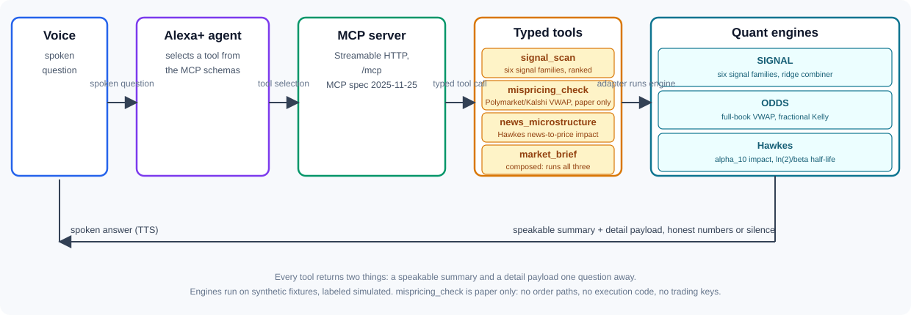

# AlphaVoice

[](https://github.com/RosarioM123/alphavoice/actions/workflows/ci.yml)
[](LICENSE)
[](https://www.python.org/downloads/release/python-3120/)

A translation layer between quant models and human conversation.

AlphaVoice is a self-hosted MCP server (spec 2025-11-25, Streamable HTTP) that turns an Alexa+ agent into a quant research desk. Speak a market question, get a spoken answer with real numbers behind it.

## Data flow

Utterance becomes an Alexa+ agent call, the agent selects tools over MCP schemas, the engine runs, a speakable summary comes back with the detail payload one question away, and the summary is spoken.

## Architecture



## Four tools

- **signal_scan**: scans six signal families and combines them with a ridge combiner to rank trade ideas.
- **mispricing_check**: prices full-book VWAP across Polymarket and Kalshi, sizes positions with fractional Kelly, paper only. It never executes.
- **news_microstructure**: fits a Hawkes process to news-to-price impact. It reports alpha_10 (impact magnitude), half-life ln(2)/beta, and whether the regime is sub-critical or explosive.
- **market_brief**: the composed multi-tool path. Runs all three tools on the synthetic fixtures and synthesizes one spoken verdict, the centerpiece of the demo.

## Four design decisions

1. **MCP, not a custom API.** The server follows the MCP spec 2025-11-25 over Streamable HTTP. It is self-hostable on free infra, so the agent talks to it through a standard protocol instead of a bespoke endpoint.
2. **Narrow typed tool interfaces.** Each tool takes a small set of typed inputs and returns two things: a speakable summary and a detail payload. A voice answer gets a 30-second budget, and the detail is always one question away.
3. **Honest numbers or silence.** Every output exposes confidence and freshness. When the data cannot support a claim, the system says so out loud instead of inventing one.
4. **Designed for ears, not eyes.** Speech rules govern every answer: never more precision than the data earns, confidence stated qualitatively, and every claim ends with an offer for more detail.

## Quickstart

AlphaVoice wraps two existing quant engines, so clone them as siblings first:

```bash
mkdir -p ~/workspace
git clone https://github.com/RosarioM123/signal-research-lab.git ~/workspace/signal-build
git clone https://github.com/RosarioM123/odds-prediction-mispricing.git ~/workspace/odds-prediction-mispricing
```

(Or point `SIGNAL_ROOT` and `ODDS_ROOT` at wherever yours live.)

```bash
python -m venv .venv
source .venv/bin/activate
pip install -r requirements.txt
```

Run the server (defaults to port 8000):

```bash
.venv/bin/python -m server.main
```

Open the browser demo:

```bash
open web/index.html
```

Run the test suite:

```bash
pytest
```

## Repo map

```
alphavoice/
  README.md            this file
  LICENSE              license choice (see top-of-file note)
  docs/
    architecture.svg   system diagram: voice to spoken answer
    adr/               architecture decision records for the five design decisions
    alexa-integration.md production path from the web sim to a real Alexa+ agent
    demo-script.md       60-second demo script
    friction-log.md      builder friction log (template)
    product-feedback.md  DRAFT feedback on the MCP SDK
  evals/               tool-routing eval harness (questions, router, report)
  server/              the MCP server and tool implementations
  tests/               engine and contract tests
  web/                 browser simulation of the voice experience
```

## What is new in the hackathon window

The quant engines pre-date this project: the signal families, the ridge combiner, the mispricing math, and the Hawkes fitting already existed. Built during the hackathon window: the MCP server itself, the four tool schemas (including the composed market_brief path), the voice interaction design, the summary/detail contract, the speech rules, the routing eval harness, and the demo. The code in `server/`, the tests in `tests/`, the evals in `evals/`, and the simulation in `web/` are the evidence.

## Honesty notes

- Any simulated or synthetic data in the demo is labeled as simulated.
- `mispricing_check` is paper only. Nothing in this repo places real trades or executes orders.
- The web experience is a simulation of the voice interaction, labeled as simulated.
